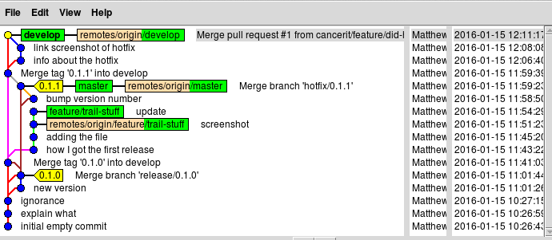

# Commands run
Or at least, commands run which we remembered to paste in...

## Hotfix!

```
mca@cgpbar:~/gitwk-cgp/hf-training$ git hf hotfix start
Missing argument <version>
usage: git hf hotfix [list] [-v]
       git hf hotfix start <version> [<base>]
       git hf hotfix finish [-sumpk] <version>
       git hf hotfix track <name>
       git hf hotfix pull [-r] [<remote> [<version>]]
       git hf hotfix push [<remote> [<version>]]
       git hf hotfix cancel [-f] <version>
1@cgpbar:~/gitwk-cgp/hf-training$ git hf hotfix start 0.1.0
Fetching origin
Tag '0.1.0' already exists. Pick another name.
1@cgpbar:~/gitwk-cgp/hf-training$ git hf hotfix start 0.1.1
Fetching origin
Switched to a new branch 'hotfix/0.1.1'
Total 0 (delta 0), reused 0 (delta 0)
To git@github.com:cancerit/hf-training.git
 * [new branch]      hotfix/0.1.1 -> hotfix/0.1.1

Summary of actions:
- A new branch 'hotfix/0.1.1' was created, based on 'master'
- The branch 'hotfix/0.1.1' has been pushed up to 'origin/hotfix/0.1.1'
- You are now on branch 'hotfix/0.1.1'

Follow-up actions:
- Bump the version number now!
- Start committing your hot fixes
- When done, run:

     git hf hotfix finish '0.1.1'

mca@cgpbar:~/gitwk-cgp/hf-training$ git add version.txt 
mca@cgpbar:~/gitwk-cgp/hf-training$ git ci -m 'bump version number
bash2> 
bash2> the sole change for this hotfix'
[hotfix/0.1.1 7cd20c7] bump version number
 1 file changed, 1 insertion(+), 1 deletion(-)
mca@cgpbar:~/gitwk-cgp/hf-training$ git hf hotfix finish '0.1.1'
...write some comments in $EDITOR...
Merge made by the 'recursive' strategy.
 version.txt | 2 +-
 1 file changed, 1 insertion(+), 1 deletion(-)
To git@github.com:cancerit/hf-training.git
 - [deleted]         hotfix/0.1.1
Deleted branch hotfix/0.1.1 (was 7cd20c7).
Counting objects: 5, done.
Compressing objects: 100% (4/4), done.
Writing objects: 100% (5/5), 668 bytes | 0 bytes/s, done.
Total 5 (delta 2), reused 0 (delta 0)
To git@github.com:cancerit/hf-training.git
   6b2ff0e..ec56c9f  develop -> develop
Total 0 (delta 0), reused 0 (delta 0)
To git@github.com:cancerit/hf-training.git
   91169d2..ba6d21f  master -> master
Counting objects: 1, done.
Writing objects: 100% (1/1), 180 bytes | 0 bytes/s, done.
Total 1 (delta 0), reused 0 (delta 0)
To git@github.com:cancerit/hf-training.git
 * [new tag]         0.1.1 -> 0.1.1

Summary of actions:
- Latest objects have been fetched from 'origin'
- Hotfix branch has been merged into 'master'
- The hotfix was tagged '0.1.1'
- Hotfix branch has been back-merged into 'develop'
- Hotfix branch 'hotfix/0.1.1' has been deleted
- 'develop', 'master' and tags have been pushed to 'origin'

mca@cgpbar:~/gitwk-cgp/hf-training$ 
```

## Info about the hotfix
On another feature, before the first is merged.

We're headed for a conflict.

```
130@cgpbar:~/gitwk-cgp/hf-training$ git hf feature start did-hotfix
fatal: Index contains uncommited changes. Aborting.
1@cgpbar:~/gitwk-cgp/hf-training$ git stash
Saved working directory and index state WIP on develop: ec56c9f Merge tag '0.1.1' into develop
HEAD is now at ec56c9f Merge tag '0.1.1' into develop
mca@cgpbar:~/gitwk-cgp/hf-training$ git st
On branch develop
Your branch is up-to-date with 'origin/develop'.
nothing to commit, working directory clean
mca@cgpbar:~/gitwk-cgp/hf-training$ ls
README.md  README.md~  version.txt
mca@cgpbar:~/gitwk-cgp/hf-training$ git hf feature start did-hotfix
Fetching origin
Switched to a new branch 'feature/did-hotfix'
Total 0 (delta 0), reused 0 (delta 0)
To git@github.com:cancerit/hf-training.git
 * [new branch]      feature/did-hotfix -> feature/did-hotfix

Summary of actions:
- A new branch 'feature/did-hotfix' was created, based on 'develop'
- The branch 'feature/did-hotfix' has been pushed up to 'origin/feature/did-hotfix'
- You are now on branch 'feature/did-hotfix'

Now, start committing on your feature. When done, create a
pull request on GitHub.  Once that has been merged, use:

     git hf feature finish did-hotfix

mca@cgpbar:~/gitwk-cgp/hf-training$ git stash pop
On branch feature/did-hotfix
Your branch is up-to-date with 'origin/feature/did-hotfix'.
Changes to be committed:
  (use "git reset HEAD <file>..." to unstage)

        new file:   hotfixed.png
        new file:   trail.md

Dropped refs/stash@{0} (d66eb90f19f7b2ecf40ad92b68004465cc4c9f16)
mca@cgpbar:~/gitwk-cgp/hf-training$ git ci -m 'info about the hotfix'
[feature/did-hotfix b9e3c24] info about the hotfix
 2 files changed, 76 insertions(+)
 create mode 100644 hotfixed.png
 create mode 100644 trail.md
mca@cgpbar:~/gitwk-cgp/hf-training$ git add trail.md 
mca@cgpbar:~/gitwk-cgp/hf-training$ git ci -m 'link screenshot of hotfix'
[feature/did-hotfix 194f343] link screenshot of hotfix
 1 file changed, 56 insertions(+)
mca@cgpbar:~/gitwk-cgp/hf-training$ git hf feature finish did-hotfix
Fetching origin
Branches 'feature/did-hotfix' and 'origin/feature/did-hotfix' have diverged.
And local branch 'feature/did-hotfix' is ahead of 'origin/feature/did-hotfix'.

Feature branch has not yet been merged into origin/develop.
Please raise a pull-request via GitHub first, or use the -f flag.
1@cgpbar:~/gitwk-cgp/hf-training$ git push
warning: push.default is unset; its implicit value has changed in
Git 2.0 from 'matching' to 'simple'. To squelch this message
and maintain the traditional behavior, use:

  git config --global push.default matching

To squelch this message and adopt the new behavior now, use:

  git config --global push.default simple

When push.default is set to 'matching', git will push local branches
to the remote branches that already exist with the same name.

Since Git 2.0, Git defaults to the more conservative 'simple'
behavior, which only pushes the current branch to the corresponding
remote branch that 'git pull' uses to update the current branch.

See 'git help config' and search for 'push.default' for further information.
(the 'simple' mode was introduced in Git 1.7.11. Use the similar mode
'current' instead of 'simple' if you sometimes use older versions of Git)

Counting objects: 7, done.
Compressing objects: 100% (7/7), done.
Writing objects: 100% (7/7), 54.32 KiB | 0 bytes/s, done.
Total 7 (delta 2), reused 0 (delta 0)
To git@github.com:cancerit/hf-training.git
   ec56c9f..194f343  feature/did-hotfix -> feature/did-hotfix
mca@cgpbar:~/gitwk-cgp/hf-training$ # did a pull request and merge in Github
mca@cgpbar:~/gitwk-cgp/hf-training$ git hf feature finish did-hotfix
Fetching origin
remote: Counting objects: 1, done.
remote: Total 1 (delta 0), reused 0 (delta 0), pack-reused 0
Unpacking objects: 100% (1/1), done.
From github.com:cancerit/hf-training
   ec56c9f..2f56bc5  develop    -> origin/develop
Switched to branch 'develop'
Your branch is behind 'origin/develop' by 3 commits, and can be fast-forwarded.
  (use "git pull" to update your local branch)
Updating ec56c9f..2f56bc5
Fast-forward
 hotfixed.png | Bin 0 -> 55069 bytes
 trail.md     | 132 ++++++++++++++++++++++++++++++++++++++++++++++++++++++++++++++++++++++++++++++++++++++++++++++++++++++++++++++++++++++++++++++++++++
 2 files changed, 132 insertions(+)
 create mode 100644 hotfixed.png
 create mode 100644 trail.md
Already up-to-date.
To git@github.com:cancerit/hf-training.git
 - [deleted]         feature/did-hotfix
Deleted branch feature/did-hotfix (was 194f343).

Summary of actions:
- The latest changes from 'origin' were merged into 'master' and 'develop'
- The feature branch 'feature/did-hotfix' was merged into 'develop'
- Feature branch 'feature/did-hotfix' has been removed
- Feature branch 'origin/feature/did-hotfix' has been removed
- You are now on branch 'develop'
```

It looked like this,


Doing this feature branch leaves it like this,
.
