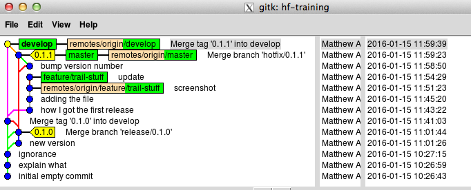

# Commands run
Or at least, commands run which we remembered to paste in...

## Hotfix!

```
mca@cgpbar:~/gitwk-cgp/hf-training$ git hf hotfix start
Missing argument <version>
usage: git hf hotfix [list] [-v]
       git hf hotfix start <version> [<base>]
       git hf hotfix finish [-sumpk] <version>
       git hf hotfix track <name>
       git hf hotfix pull [-r] [<remote> [<version>]]
       git hf hotfix push [<remote> [<version>]]
       git hf hotfix cancel [-f] <version>
1@cgpbar:~/gitwk-cgp/hf-training$ git hf hotfix start 0.1.0
Fetching origin
Tag '0.1.0' already exists. Pick another name.
1@cgpbar:~/gitwk-cgp/hf-training$ git hf hotfix start 0.1.1
Fetching origin
Switched to a new branch 'hotfix/0.1.1'
Total 0 (delta 0), reused 0 (delta 0)
To git@github.com:cancerit/hf-training.git
 * [new branch]      hotfix/0.1.1 -> hotfix/0.1.1

Summary of actions:
- A new branch 'hotfix/0.1.1' was created, based on 'master'
- The branch 'hotfix/0.1.1' has been pushed up to 'origin/hotfix/0.1.1'
- You are now on branch 'hotfix/0.1.1'

Follow-up actions:
- Bump the version number now!
- Start committing your hot fixes
- When done, run:

     git hf hotfix finish '0.1.1'

mca@cgpbar:~/gitwk-cgp/hf-training$ git add version.txt 
mca@cgpbar:~/gitwk-cgp/hf-training$ git ci -m 'bump version number
bash2> 
bash2> the sole change for this hotfix'
[hotfix/0.1.1 7cd20c7] bump version number
 1 file changed, 1 insertion(+), 1 deletion(-)
mca@cgpbar:~/gitwk-cgp/hf-training$ git hf hotfix finish '0.1.1'
...write some comments in $EDITOR...
Merge made by the 'recursive' strategy.
 version.txt | 2 +-
 1 file changed, 1 insertion(+), 1 deletion(-)
To git@github.com:cancerit/hf-training.git
 - [deleted]         hotfix/0.1.1
Deleted branch hotfix/0.1.1 (was 7cd20c7).
Counting objects: 5, done.
Compressing objects: 100% (4/4), done.
Writing objects: 100% (5/5), 668 bytes | 0 bytes/s, done.
Total 5 (delta 2), reused 0 (delta 0)
To git@github.com:cancerit/hf-training.git
   6b2ff0e..ec56c9f  develop -> develop
Total 0 (delta 0), reused 0 (delta 0)
To git@github.com:cancerit/hf-training.git
   91169d2..ba6d21f  master -> master
Counting objects: 1, done.
Writing objects: 100% (1/1), 180 bytes | 0 bytes/s, done.
Total 1 (delta 0), reused 0 (delta 0)
To git@github.com:cancerit/hf-training.git
 * [new tag]         0.1.1 -> 0.1.1

Summary of actions:
- Latest objects have been fetched from 'origin'
- Hotfix branch has been merged into 'master'
- The hotfix was tagged '0.1.1'
- Hotfix branch has been back-merged into 'develop'
- Hotfix branch 'hotfix/0.1.1' has been deleted
- 'develop', 'master' and tags have been pushed to 'origin'

mca@cgpbar:~/gitwk-cgp/hf-training$ 
```

## Info about the hotfix
On another feature, before the first is merged.

We're headed for a conflict.

```
130@cgpbar:~/gitwk-cgp/hf-training$ git hf feature start did-hotfix
fatal: Index contains uncommited changes. Aborting.
1@cgpbar:~/gitwk-cgp/hf-training$ git stash
Saved working directory and index state WIP on develop: ec56c9f Merge tag '0.1.1' into develop
HEAD is now at ec56c9f Merge tag '0.1.1' into develop
mca@cgpbar:~/gitwk-cgp/hf-training$ git st
On branch develop
Your branch is up-to-date with 'origin/develop'.
nothing to commit, working directory clean
mca@cgpbar:~/gitwk-cgp/hf-training$ ls
README.md  README.md~  version.txt
mca@cgpbar:~/gitwk-cgp/hf-training$ git hf feature start did-hotfix
Fetching origin
Switched to a new branch 'feature/did-hotfix'
Total 0 (delta 0), reused 0 (delta 0)
To git@github.com:cancerit/hf-training.git
 * [new branch]      feature/did-hotfix -> feature/did-hotfix

Summary of actions:
- A new branch 'feature/did-hotfix' was created, based on 'develop'
- The branch 'feature/did-hotfix' has been pushed up to 'origin/feature/did-hotfix'
- You are now on branch 'feature/did-hotfix'

Now, start committing on your feature. When done, create a
pull request on GitHub.  Once that has been merged, use:

     git hf feature finish did-hotfix

mca@cgpbar:~/gitwk-cgp/hf-training$ git stash pop
On branch feature/did-hotfix
Your branch is up-to-date with 'origin/feature/did-hotfix'.
Changes to be committed:
  (use "git reset HEAD <file>..." to unstage)

        new file:   hotfixed.png
        new file:   trail.md

Dropped refs/stash@{0} (d66eb90f19f7b2ecf40ad92b68004465cc4c9f16)
mca@cgpbar:~/gitwk-cgp/hf-training$ git ci -m 'info about the hotfix'
[feature/did-hotfix b9e3c24] info about the hotfix
 2 files changed, 76 insertions(+)
 create mode 100644 hotfixed.png
 create mode 100644 trail.md
mca@cgpbar:~/gitwk-cgp/hf-training$ git hf feature finish did-hotfix
```

It looked like this,


