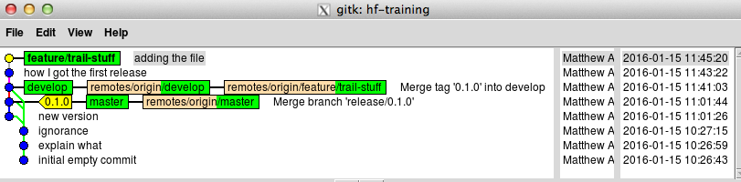

# Commands run
Or at least, commands run which we remembered to paste in...

## Initial setup
```
mca@cgpbar:~/gitwk-cgp$ git clone git@github.com:cancerit/hf-training.git
Cloning into 'hf-training'...
warning: You appear to have cloned an empty repository.
Checking connectivity... done.
mca@cgpbar:~/gitwk-cgp$ cd hf-training/
mca@cgpbar:~/gitwk-cgp/hf-training$ git iec              # this is a non-standard command
[master (root-commit) 5022a0f] initial empty commit
mca@cgpbar:~/gitwk-cgp/hf-training$ git add README.md
mca@cgpbar:~/gitwk-cgp/hf-training$ git ci -m 'explain what'
[master b7617fd] explain what
 1 file changed, 6 insertions(+)
 create mode 100644 README.md
mca@cgpbar:~/gitwk-cgp/hf-training$ cat > .gitignore

# emacs
*~
mca@cgpbar:~/gitwk-cgp/hf-training$ git add .gitignore 
mca@cgpbar:~/gitwk-cgp/hf-training$ git ci -m 'ignorance'
[master 5c8120e] ignorance
 1 file changed, 3 insertions(+)
 create mode 100644 .gitignore
mca@cgpbar:~/gitwk-cgp/hf-training$ git hf init
Using default branch names.

Which branch should be used for tracking production releases?
   - master
Branch name for production releases: [master] 
Branch name for "next release" development: [develop] 

How to name your supporting branch prefixes?
Feature branches? [feature/] 
Release branches? [release/] 
Hotfix branches? [hotfix/] 
Support branches? [support/] 
Version tag prefix? [] 
Counting objects: 8, done.
Compressing objects: 100% (5/5), done.
Writing objects: 100% (8/8), 806 bytes | 0 bytes/s, done.
Total 8 (delta 0), reused 0 (delta 0)
To git@github.com:cancerit/hf-training.git
 * [new branch]      develop -> develop
```

## First release
```
mca@cgpbar:~/gitwk-cgp/hf-training$ git hf release start 0.1.0
Fetching origin
Switched to a new branch 'release/0.1.0'
Total 0 (delta 0), reused 0 (delta 0)
To git@github.com:cancerit/hf-training.git
 * [new branch]      release/0.1.0 -> release/0.1.0

Summary of actions:
- A new branch 'release/0.1.0' was created, based on 'develop'
- The branch 'release/0.1.0' has been pushed up to 'origin/release/0.1.0'
- You are now on branch 'release/0.1.0'

Follow-up actions:
- Bump the version number now!
- Start committing last-minute fixes in preparing your release
- When done, run:

     git hf release finish '0.1.0'

mca@cgpbar:~/gitwk-cgp/hf-training$ echo 0.1.0 > version.txt
mca@cgpbar:~/gitwk-cgp/hf-training$ git add version.txt 
mca@cgpbar:~/gitwk-cgp/hf-training$ git ci -m 'new version'
[release/0.1.0 913bb25] new version
 1 file changed, 1 insertion(+)
 create mode 100644 version.txt
mca@cgpbar:~/gitwk-cgp/hf-training$ git hf release finish '0.1.0'
...write some release comments in $EDITOR...
Merge made by the 'recursive' strategy.
 version.txt | 1 +
 1 file changed, 1 insertion(+)
 create mode 100644 version.txt
Deleted branch release/0.1.0 (was 913bb25).
Counting objects: 2, done.
Compressing objects: 100% (2/2), done.
Writing objects: 100% (2/2), 400 bytes | 0 bytes/s, done.
Total 2 (delta 1), reused 0 (delta 0)
To git@github.com:cancerit/hf-training.git
   5c8120e..6b2ff0e  develop -> develop
Total 0 (delta 0), reused 0 (delta 0)
To git@github.com:cancerit/hf-training.git
 * [new branch]      master -> master
Counting objects: 1, done.
Writing objects: 100% (1/1), 181 bytes | 0 bytes/s, done.
Total 1 (delta 0), reused 0 (delta 0)
To git@github.com:cancerit/hf-training.git
 * [new tag]         0.1.0 -> 0.1.0
To git@github.com:cancerit/hf-training.git
 - [deleted]         release/0.1.0

Summary of actions:
- Latest objects have been fetched from 'origin'
- Release branch has been merged into 'master'
- The release was tagged '0.1.0'
- Tag '0.1.0' has been back-merged into 'develop'
- Branch 'master' has been back-merged into 'develop'
- Release branch 'release/0.1.0' has been deleted
- 'develop', 'master' and tags have been pushed to 'origin'
- Release branch 'release/0.1.0' in 'origin' has been deleted.

mca@cgpbar:~/gitwk-cgp/hf-training$ 
```

## First feature, shows this file
Something that isn't going to appear in my upcoming hotfix,
and looks like [this](feature.png) in gitk.

Note master points at the last release.
```
mca@cgpbar:~/gitwk-cgp/hf-training$ git hf feature start trail-stuff
Fetching origin
Switched to a new branch 'feature/trail-stuff'
Total 0 (delta 0), reused 0 (delta 0)
To git@github.com:cancerit/hf-training.git
 * [new branch]      feature/trail-stuff -> feature/trail-stuff

Summary of actions:
- A new branch 'feature/trail-stuff' was created, based on 'develop'
- The branch 'feature/trail-stuff' has been pushed up to 'origin/feature/trail-stuff'
- You are now on branch 'feature/trail-stuff'

Now, start committing on your feature. When done, create a
pull request on GitHub.  Once that has been merged, use:

     git hf feature finish trail-stuff

mca@cgpbar:~/gitwk-cgp/hf-training$ git add trail.md
mca@cgpbar:~/gitwk-cgp/hf-training$ git ci -m 'how I got the first release'
[feature/trail-stuff 5bfd8df] how I got the first release
 1 file changed, 111 insertions(+)
 create mode 100644 trail.md
mca@cgpbar:~/gitwk-cgp/hf-training$ git add trail.md 
mca@cgpbar:~/gitwk-cgp/hf-training$ git ci -m 'adding the file'
[feature/trail-stuff b36e1a2] adding the file
 1 file changed, 27 insertions(+)
mca@cgpbar:~/gitwk-cgp/hf-training$ git branch -avv --color=auto
  develop                            6b2ff0e [origin/develop] Merge tag '0.1.0' into develop
* feature/trail-stuff                b36e1a2 [origin/feature/trail-stuff: ahead 2] adding the file
  master                             91169d2 [origin/master] Merge branch 'release/0.1.0'
  remotes/origin/develop             6b2ff0e Merge tag '0.1.0' into develop
  remotes/origin/feature/trail-stuff 6b2ff0e Merge tag '0.1.0' into develop
  remotes/origin/master              91169d2 Merge branch 'release/0.1.0'

...take a screenshot of gitk...

mca@cgpbar:~/gitwk-cgp/hf-training$ git add feature.png 
mca@cgpbar:~/gitwk-cgp/hf-training$ git add trail.md 
mca@cgpbar:~/gitwk-cgp/hf-training$ git ci -m 'screenshot'
[feature/trail-stuff 22fa1da] screenshot
 2 files changed, 16 insertions(+), 1 deletion(-)
 create mode 100644 feature.png
mca@cgpbar:~/gitwk-cgp/hf-training$ git push
warning: push.default is unset; its implicit value has changed in
Git 2.0 from 'matching' to 'simple'. To squelch this message
and maintain the traditional behavior, use:

  git config --global push.default matching

To squelch this message and adopt the new behavior now, use:

  git config --global push.default simple

When push.default is set to 'matching', git will push local branches
to the remote branches that already exist with the same name.

Since Git 2.0, Git defaults to the more conservative 'simple'
behavior, which only pushes the current branch to the corresponding
remote branch that 'git pull' uses to update the current branch.

See 'git help config' and search for 'push.default' for further information.
(the 'simple' mode was introduced in Git 1.7.11. Use the similar mode
'current' instead of 'simple' if you sometimes use older versions of Git)

Counting objects: 10, done.
Compressing objects: 100% (10/10), done.
Writing objects: 100% (10/10), 42.71 KiB | 0 bytes/s, done.
Total 10 (delta 3), reused 0 (delta 0)
To git@github.com:cancerit/hf-training.git
   6b2ff0e..22fa1da  feature/trail-stuff -> feature/trail-stuff
```


